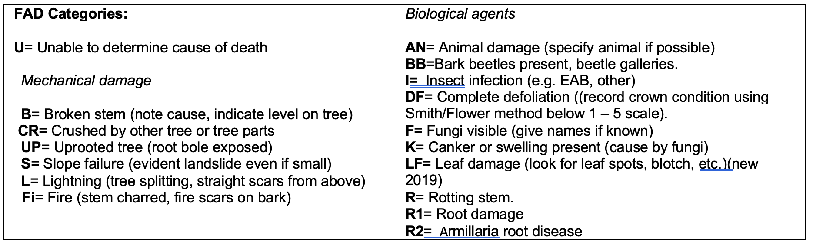
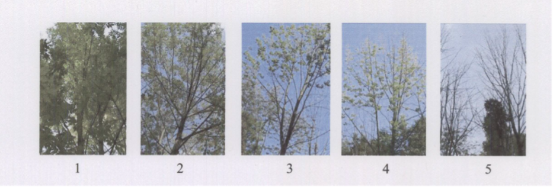

```{r setup, include=FALSE}
knitr::opts_chunk$set(echo = TRUE)
```

## Supplies
- [ ] iPad - set up with FastField and maps ([GitHub issue #6](https://github.com/SCBI-ForestGEO/SCBImortality/issues/6))
- [ ] DBH tape, calipers
- [ ] Binoculars, IMPORTANT to check live status of very tall trees and to distinguish between leaves of lianas or tree under inspection.
- [ ] Printed copies of visual guides, if desired (these could also be loaded on iPad)
- [ ] Personal gear/ safety equipment


## Procedure
### Plot Navigation & Tree Location
At the SCBI plot, a blue re-bar located in the SW corner gives the quadrat name (3 or 4 digits). Locate the rebar and orientate yourself (N-S). Locate all trees within the quadrat you are working on and make sure you complete all trees before moving to the next quadrat. Coordinates (x, y) are given in reference to a 20x20m square. 

Review info (species, size, position) of tree for which you're searching. Locate the based on x-y coordinates and/or map, check tag to ensure you've got the right tree.

*If you can't find a tree:*
(1) double check that quadrat matches data sheet/ Fastfield App
(2) look on the ground for fallen trees/ lost tags
(3) sometimes x and y coordinates get switched, so try switching and see if you find it (note wrong coordinates)
(4) check trees that otherwise don't seem to match what you're looking for
(5) if a thorough search yields nothing, record as **DN** (no plant nor tag found)
Avoid giving a tree the DN status; you need to do a thorough search for all trees on the list.


### Data Entry in FastField

*(INSTRUCTIONS NEEDED HERE)*

- Measure DBH on trees that have died. If a stem has fallen and it's DBH can't be measured with a tape, measure it later using a big caliper (find one in Radiotracking lab - Office Annex building). 
- Take pictures: Take a picture of every unhealthy or dead tree found. Include photos of all factors associated with death (FADs). Make nice close-ups if any insect or insect galleries are found. 

**Important notes:**

- If a tree is recorded as Alive unhealthy (**AU**) or dead, there should always be at least one factor associated with death (FAD) recorded, and photos should be taken
- Record Factors associated with death (FAD) ***in order of importance*** (will be listed in order selected). 
- Sometimes a tree recorded dead in a previous year is “back to life”. If a dead tree is alive in the current census (meaning you are 100% sure it is alive), mark the tree as **A** or **AU** and make a note in comments.

### Identifying Factors Associated with Death (FADs)
To scrutinize the FAD’s, look at our [Visual Guides](https://github.com/SCBI-ForestGEO/SCBImortality/blob/main/Protocols/Visual%20guides/Tree%20Mortality%20Guide_2020.pdf).

### Emerald Ash Borer Add-ons
- Estimate crown thinning via visual assessment per Smith/Flower 2013 (see figure)
- If DE are present then count all visible D-shaped holes around the circumference of the tree in an area ~50 cm long at breast height and record this number. At SCBI almost all tags are located at 1.3 m, so use the tag as reference to visually define the 50 cm area.

\newpage
## Codes

***Mortality census status codes:***
**A**: Alive and healthy
**AU**: Alive unhealthy
**DS**: Dead, stem standing, 
**DC**: Dead, stem fallen, 
**DT**: Only tag found, 
**DN**: No plant nor tag found. 

*(See [GitHub issue #8](https://github.com/SCBI-ForestGEO/SCBImortality/issues/8) regarding Ash codes)*

***Core census codes:*** 
**A**: alternate pom (point of measurement), 
**B**: stem broken above breast height, 
**C**: dead above 1.3m, 
**DS**: Dead, stem standing, 
**DC**: Dead, stem fallen, 
**DT**: Only tag found, 
**DN**: No plant nor tag found. 
**F**: Incorporated into fence, 
**G**: ID to Genus certain, 
**I**: stem irregular where measured, 
**J**: Bent, 
**L**: leaning stem, 
**M**: multiple stems, 
**main**; main stem, 
**P**: prostrate stem, 
**S**: secondary stem, 
**V**: Vine, 
**X**: stem broken below 1.3 m. 

***DBH (mm)***: Diameter at breast height in millimeters. Given for all trees as last core census. 

***Crown Position:*** 
**Dominant (D)**: Crown extends above the general level of the canopy receiving full sunlight. 
**Codominant (CD)**: Crown forms main level of canopy, tree receives full sunlight from above. 
**Intermediate (I)**: Shorter trees with smaller crowns, receive little light from above and none from sides. 
**Suppressed (S)**: Crown below canopy, small crown receives no direct light. 
**Open grown (OG)**: Crown on open areas of the stand. 

***Record Liana load***

0 = lianas absent 
1 = up to 25% of the tree crown covered by lianas 
2 = 26–50% liana cover 
3 = 51–75% liana cover 
4 = 76–100% liana cover. 



\newpage

### EAB census add-ons ([GitHub issue #5](https://github.com/SCBI-ForestGEO/SCBImortality/issues/5))

***EAB crown thinning***



**1** = healthy tree with no symptoms of decline, no defoliation
**2** = slight reduction in leaf density (thinning), yet all top branches exposed to sunlight have leaves
**3** = thinning canopy and some top branches exposed to sunlight are defoliated (<50% dieback)
**4** = >50% defoliation/dieback
**5** = Dead tree with no leaves in canopy (excluding epicormic sprouting)

***Epicormics***


***EABF (Emerald Ash Borer Factors):***
**VB** = Vertical bark splitting,
**SS** = Stump sprouts,
**AS** = Ash snap of the branches/limbs,
**W** = Bark blonding from woodpecker predation. In comment section, write percentage estimate.
**DE** = D-shaped exit hole presence.


\newpage

## Coring of Dead Trees 
If time allows, cores will be taken at the end of survey and saved for future analyses.

*Target species*: ceca, amar, cofl, ploc, prav, rops, saal, and all Quercus. 

Follow steps in document “Coring_instructions_SCBI” located in ‘Protocol’ folder.

*We will need to take data on trees cored (instructions to be determined later).*


## Changes from previous years
- Adding some measurements to align with censuses at other plots under NSF Macrosystems grant (PI Johnson)
- Some categorical measurements are replaced with more specific measurements: e.g., categories for percentage crown intact replaced with continuous estimate. 
- Switching from manual data entry in spreadsheet (iPad spreadsheet or, previously, printed data sheets) to FastField App
- Starting data checking with continuous integration
- No coring of dead trees during census (if time allows, it will be done once survey is completed)
