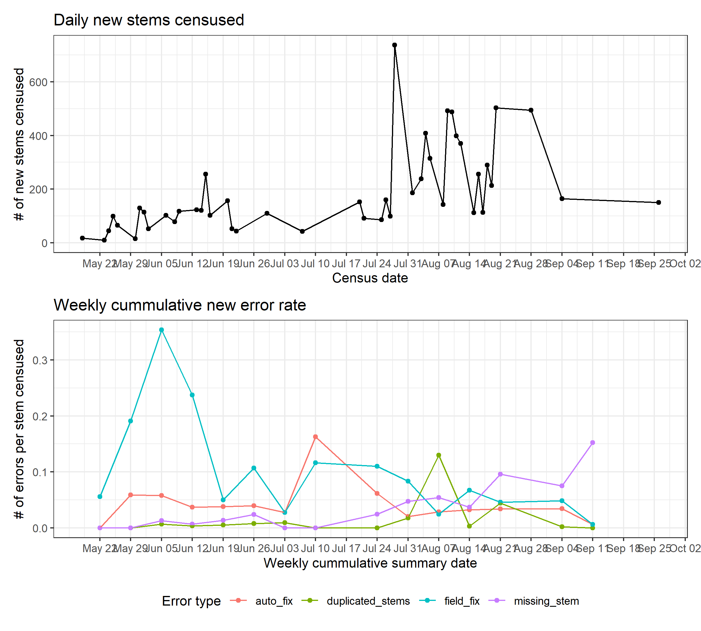

# SCBI Tree Mortality 

<!--
## Current Census Dashboard

### data entry issues to resolve?

**[Click here to view error reports.](https://github.com/SCBI-ForestGEO/SCBImortality/tree/main/testthat/reports/)**

### warnings? 
*These do not cause the tests to fail, but may indicate problems and should be reviewed.*

### mortality survey completion status

### map of census progress
 

### progress reports

- Dashed black vertical line indicates date continuous integration was officially "switched on" on July 7.
- Weekly cummulative new error rate = # of errors for that week / # of stems censused that week.  
Ex: Weekly summary on June 6 represents 3 days of censusing
- Dashed horizontal colored lines indicate mean weekly error rate, before and after CI was "switched on".  
Ex: Horizontal lines before July 7 are averages over 5 weeks

 

-->
## Survey Dashboard

### Map of survey progress
 

## Census Info

### Sampling location
[SCBI ForestGEO plot](https://forestgeo.si.edu/sites/north-america/smithsonian-conservation-biology-institute)

### Sampling dates
2014- present (annually) 

### Protocols

The basic census is described in [Gonzalez-Akre et al. (2016)](https://esajournals.onlinelibrary.wiley.com/doi/abs/10.1002/ecs2.1595). This publication covers methods used in 2014 and 2015. From 2016-2023, we monitored all ash tress (*Fraxinus spp.*) with stems >1cm DBH in order to capture dynamics of the Emerald Ash Borer (EAB) infestation. For updated methods please check [this folder](https://github.com/SCBI-ForestGEO/SCBImortality/tree/main/doc/Protocols).

We have collected cores from many of the trees found dead in our censuses. In 2016-2017, all trees found dead in 2016 and 2017 were cored at breast height (1.3 m) and at base (~30 cm form ground) except if trees where extremely rotten or if other hazards prevented boring or resulted in a very poor quality core. Since 2018 we have reduced the number of cores taken from dead trees as we have good chronologies for multiple species and to avoid additional work from our field technicians. Tree core data can be found [here](https://github.com/SCBI-ForestGEO/SCBI-ForestGEO-Data/tree/master/tree_cores).

Numbers of trees and species cored since 2017 is as follows:

- 2016 - all trees found dead
- 2017 - all trees found dead
- 2018 - 24 cores, 7 sp
- 2019 - 51 cores, 19 sp
- 2020 - 68 cores, 15 sp 
- 2021 - 
- 2022 - no cores collected
- 2023 - no cores collected
- 2024 - no cores collected

As a resut of our annual surveys, We have been paying increasing attention to signs of insect pests and pathogens on newly dead and unhealthy trees. A list of pests and pathogens that may affect trees at the SCBI plot is given [here](https://github.com/SCBI-ForestGEO/SCBI-ForestGEO-Data/tree/master/species_lists/insects_pathogens).

## New mortality census
See this (README.md)[https://github.com/SCBI-ForestGEO/SCBImortality/blob/main/raw_data/README.md]

## Data use

Data are published to this reposity immediately upon collection.
We require that the (mostly early-career) members of our team who contributed to data collection be given the opportunity to contribute as coauthors (with full opportunity to comment on analysis plans and draft manuscripts) to the first scientific publication using the data.
Data usage agreements thefore depend upon collection date, currently deliniated as specified below.

### Data from 2014-2019, 2021
These data are licensed under the [Creative Commons Attribution 4.0 International](https://github.com/SCBI-ForestGEO/SCBImortality?tab=CC-BY-4.0-1-ov-file#readme) license.

### Data from 2020, 2022 - present
These data are covered by a custom data use agreement. 
Please refer to the [data_use_agreement.md](https://github.com/SCBI-ForestGEO/SCBImortality/blob/main/data_use_agreement.md) file for details.
*Data use requests may be denied if they compete with planned publications (particularly those led by early-career researchers) or fail to adhere to acceptable standards of scientific integrity and rigour.*
We strongly advise contacting PI [Kristina Anderson-Texeira](teixeirak@si.edu) prior to beginning analysis of these data.

## Contributors
| name | GitHub ID| position* | role |
| -----| ---- | ---- |---- |
| Kristina Anderson-Teixeira | teixeirak | staff scientist, SCBI & STRI | PI overseeing project |
| Erika Gonzalez-Akre | gonzalezeb | lab manager, SCBI | designed census, led 2014 census, oversaw subsequent censuses until 2020 |
| Cheng-Yin Eng |  | research assistant , SCBI | led 2015 census |
| Victoria Meakem |  | research assistant, SCBI | led 2016 census |
| Ryan Helcoski | RHelcoski | research assistant, SCBI | led 2017 census |
| Maya Prestipino | PrestipinoMN  | research assistant, SCBI | volunteered for 2017 census, led 2018 census |
| Alyssa Terrell |  alyssaterrell | research assistant, SCBI | volunteered for 2018 census, led 2019 census |
| Katherine Aldrich |   | field assistant, SCBI | volunteered for 2016 census |
| Clayton Hatcher |   | field assistant, SCBI | volunteered for 2016 census |
| Abigail Ferson | aferson  | field assistant, SCBI | volunteered for 2017 census |
| Meghan Ward |   | field assistant, SCBI | volunteered for 2019 census |
| Alex Georgopolis |   | field assistant, SCBI | volunteered for 2019 census |
| Cameron Dow | camerondow35 | research assistant, SCBI | led 2020 census |
| Albert Y. Kim | rudeboybert | research associate and 2020 sabbatical visitor, SCBI | volunteered for 2020 census, continuous integration |
| Valentine Herrmann | ValentineHerr | ecologist, SCBI | data organization, coding, continuous integration |
| Brianna Calkins | briannakcalkins | field assistant, SCBI | 2021 census leader |
| Jennifer Jordan | jenajordan | field assistant, SCBI | 2021, 2022 census assistant |
| Teagan Rogers | Troger4 | field assistant, SCBI | 2021 census assistant |
| Isabella Dangler | irdangler | SMSC student | tree disease guide |
| Erin MacMonigle | emacmonigle | field assistant, SCBI | 2022 census leader |
| Katherina Wilkins |  | field assistant, SCBI | 2022 census assistant, 2022 field fixes |
| Lukas Magee | mageeluke | PhD Student, UFL | assisted with censusin 2022, 2023 |
| David Mitre | mitreds | research technician, STRI | 2023 census lead |
| Jessica Shue | jess-shue | research technician, SERC | 2023 census prep, training & data support |
|Iris Kennedy|Iriskennedy|ForestGEO Intern| 2023 census - Data collection  and data entry|
| Krystal Bagnaschi | krystalbagnaschi | ForestGEO Intern | 2023 census - Data collection and entry |
| Caroline Troy | CarolineTroy | ForestGEO Intern | 2023 census - Data collection and entry |
| Rachel Hoffman | rmh24 | ForestGEO Intern | 2023 census - Data collection and entry |
| Erin MacMonigle |emacmonigle | ForestGEO Intern | 2023 census -  Data collection and entry |
| Christopher Pate 	| christopherp8 	| ForestGEO Intern 	| 2023 census - Data collection and entry|
 
*refers to position at time of main contribution to this repository

### Funding 
- ForestGEO 
- Virginia Native Plant Society (2017, 2019)
- NSF Macrosystems (2021 - 2024)

### Publications using these data

Gonzalez-Akre, E. B., Meakem, V., Eng, C.Y., Tepley, A. J., Bourg, N. A., McShea, W. J., Davies, S. J. and Anderson-Teixeira, K. J. (2016). [Patterns of tree mortality in a temperate deciduous forest derived from a large forest dynamics plot.](https://esajournals.onlinelibrary.wiley.com/doi/abs/10.1002/ecs2.1595) Ecosphere 7(12): e01595. doi: 10.1002/ecs2.1595.  
*Data from this publication are published in [Dryad](http://dx.doi.org/10.5061/dryad.v5h24.)* 

Anderson-Teixeira, K. J., V. Herrmann, W. B. Cass, A. B. Williams, S. J. Paull, E. B. Gonzalez-Akre, R. Helcoski, A. J. Tepley, N. A. Bourg, C. T. Cosma, A. E. Ferson, C. Kittle, V. Meakem, I. R. McGregor, M. N. Prestipino, M. K. Scott, A. R. Terrell, A. Alonso, F. Dallmeier, and W. J. McShea. 2020. [Long-Term Impacts of Invasive Insects and Pathogens on Composition, Biomass, and Diversity of Forests in Virginia’s Blue Ridge Mountains](https://link.springer.com/article/10.1007%2Fs10021-020-00503-w). Ecosystems.  DOI: 10.1007/s10021-020-00503-w.

Kim, A. Y., V. Herrmann, R. Bareto, B. Calkins, E. Gonzalez-Akre, D. J. Johnson, J. A. Jordan, L. Magee, I. R. McGregor, N. Montero, K. Novak, T. Rogers, J. Shue, and K. J. Anderson-Teixeira. 2022. Implementing GitHub Actions continuous integration to reduce error rates in ecological data collection. Methods in Ecology and Evolution 13(11): 2572-2585. DOI: http://doi.org/10.1111/2041-210X.13982 
