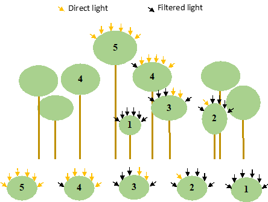
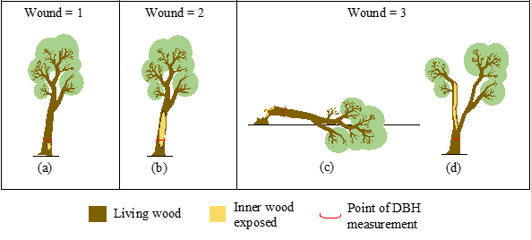
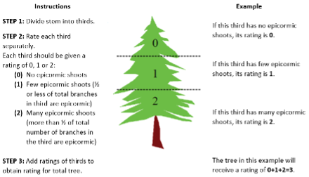

```{r setup, include=FALSE}
knitr::opts_chunk$set(echo = TRUE)
```

## Supplies
- [ ] iPad - set up with FastField and maps ([GitHub issue #6](https://github.com/SCBI-ForestGEO/SCBImortality/issues/6))
- [ ] DBH tape, calipers
- [ ] phone with clinometer app, or physical clinometer. I assume this could also be installed on the iPads.
- [ ] Binoculars, IMPORTANT to check live status of very tall trees and to distinguish between leaves of lianas or tree under inspection.
- [ ] Printed copies of visual guides, if desired (these could also be loaded on iPad)
- [ ] List of tree species codes, available [here](https://github.com/SCBI-ForestGEO/SCBI-ForestGEO-Data/blob/master/species_lists/Tree%20ecology/SCBI_ForestGEO_sp_ecology.csv), if desired
- [ ] Personal gear/ safety equipment


## Procedure
### Plot Navigation & Tree Location
At the SCBI plot, a blue re-bar located in the SW corner gives the quadrat name (3 or 4 digits). Locate the rebar and orientate yourself (N-S). Locate all trees within the quadrat you are working on and make sure you complete all trees before moving to the next quadrat. Coordinates (x, y) are given in reference to a 20x20m square. 

Review info (species, size, position) of tree for which you're searching. Locate the based on x-y coordinates and/or map, check tag to ensure you've got the right tree.

*If you can't find a tree:*
(1) double check that quadrat matches data sheet/ Fastfield App
(2) look on the ground for fallen trees/ lost tags
(3) sometimes x and y coordinates get switched, so try switching and see if you find it (note wrong coordinates)
(4) check trees that otherwise don't seem to match what you're looking for
(5) if a thorough search yields nothing, record as **DN** (no plant nor tag found)
Avoid giving a tree the DN status; you need to do a thorough search for all trees on the list.
*One of the challenges of this survey is getting frustrated when you can't find those little ash trees and wanting to give up. The solution is to go back another day or week with a fresh mind set and you'll usually find them. Sometimes they're just a stick on the ground, but they're there!* 

### Data Entry in FastField
#### Tree Classification

*If the status us "A":*
(1) Mark status
(2) Record crown position
(3) Record percentage of crown still intact (%)
(4) Record percentage of crown living

*If the status is "AU"*
AU is used for trees that are alive but noticeably unhealthy (e.g., fallen and uprooted but not yet dead, wounded, insect damage):
(1) Record FADs in order of importance* (at least 1 factor)- See FAD codes below.
(2)	Record crown position. 
(3)	Record percentage of crown still intact (%). 
(4)	Record percentage of crown living
(5)	Record lean angle (if leaning > 15$^\circ$)
(6)	Record Liana load. 
(7)	Record wound, canker, or rot categories (if applicable) 
(8)	Take pictures: Take a picture of alive unhealthy tree if picture appropriately captures FAD. For example, take picture of wounds to main bole, but not of leaf damage high in canopy. Take a picture of the tag first then make 2-3 pics of main FADS. Make nice close-ups if any insect or insect galleries are found. 


*If the status is "DS" & previously "A":*
(1)	Record FADs in order of importance (at least 1 factor)- See FAD codes below.
(2)	Record crown position. 
(3)	Record Percentage of crown still intact (%). 
(4)	Record percentage of crown living (%)
(5)	Record lean angle (if leaning > 15$^\circ$)
(6)	Record Liana load. 
(7)	Record wound, canker, or rot categories (if applicable) 
(8)	Take pictures: Take a picture of dead tree if picture appropriately captures FAD. Take a picture of the tag first then make 2-3 pics of main FADS. Make nice close-ups if any insect or insect galleries are found. 
 
*If the status is “DC” & previously “A”:*
(1)	Record FADs in order of importance (at least 1 factor)- See FAD codes below.
(2) Record Percentage of crown still intact (%). 
(3)	Record percentage of crown living (%)
(4)	Record Liana load. 
(5)	Record wound, canker, or rot categories (if applicable) 
(6)	Take pictures: Take a picture of dead tree if picture appropriately captures FAD. Take a picture of the tag first then make 2-3 pics of main FADS. Make nice close-ups if any insect or insect galleries are found. 

--Note: for stems that were “A” and now “DG” (typically uncommon) it is unnecessary to record canopy position 

*If the status is “DS” & previously “DS”:*
(1)	Mark status 
(2)	Record crown position*. 
(3)	Record percentage of crown still intact (%)*
(4)	Record percentage of crown living (%)*
(5)	Record lean angle (if leaning > 15^$\circ$)*
(6)	Record Liana load*. 
*record this information for remote sensing/crown delineation purposes 

*If the status is “DC” & previously “DS”*  
Record status and continue. 

### --Additional Fields--
#### Factors Associated with Death/Decline (FAD)
- Record Factors associated with death (FAD) ***in order of importance*** (will be listed in order selected). 
- To scrutinize the FAD’s, look at our [Visual Guides](https://github.com/SCBI-ForestGEO/SCBImortality/blob/main/Protocols/Visual%20guides/Tree%20Mortality%20Guide_2020.pdf).
- For tree conditions or agents of mortality not specifically defined below, record diagnosis in the notes or comments section of the form. 

#### *Diameter at breast height (DBH; mm)*
- Measure DBH on trees that have died. 
- If a stem has fallen and it's DBH can't be measured with a tape, measure it later using a big caliper (find one in Radiotracking lab - Office Annex building). 
- Given for all trees as last core census. 

#### *Crown Position (dead trees only)* 
**Dominant (D)**: Crown extends above the general level of the canopy receiving full sunlight. 
**Codominant (CD)**: Crown forms main level of canopy, tree receives full sunlight from above. 
**Intermediate (I)**: Shorter trees with smaller crowns, receive little light from above and none from sides. 
**Suppressed (S)**: Crown below canopy, small crown receives no direct light. 
**Open grown (OG)**: Crown on open areas of the stand. 

#### *Lean angle (%)*
If tree is still rooted and is leaning, estimate the angle of lean in degrees from vertical. This angle is measured in degrees from the base through the POM (see figure below).

#### *Liana load (levels: 0 – 4)*
0 = lianas absent *from tree crown* (category includes trees with lianas present only on trunk)
1 = up to 25% of the tree crown covered by lianas 
2 = 26–50% liana cover 
3 = 51–75% liana cover 
4 = 76–100% liana cover. 

#### *Wounded main axis (levels: 1 = small, 2 = large, 3 = massive)—figure below*
1 = small damage, smaller in area than a square of DBH **(SC)** DBH in shape.
2 = large damage, greater in area than a square of DBH **(SC)** DBH in shape.
3 = massive damage, affecting >50% of the basal area (i.e., a very deep and extensive wound; Figure 8c) or >50% of the living length (Figure 8d). These are cases of main stem breakage in which the breakage is not complete and the broken part is still connected and alive, and trunks that have been longitudinally split in two.

#### *Canker, swelling, deformity (levels: 1 = small, 2 = large, 3 = massive)*
1 = small deformity area, smaller in area than a square of DBH **(SC)** DBH in shape.
2 = big deformity, greater in area than a square of DBH **(SC)** DBH in shape.
3 = massive deformity or canker, greater than >50% of the basal area or >50% of the main axis length.

#### *Rotting trunk (levels: 1 = small, 2 = large, 3 = massive)*
1 = small rotting area, smaller in area than a square of DBH **(SC)** DBH in shape.
2 = big rotting area, greater in area than a square of DBH **(SC)** DBH in shape.
3 = massive rotting, affecting >50% of the basal area or >50% of the main axis length.

#### *Take photos*
Take a picture of every unhealthy or dead tree found. Include photos of all factors associated with death (FADs). Make nice close-ups if any insect or insect galleries are found. 

#### *Notes*
Record any relevant info for which there's no place in the form:
- Disease/ decline symptoms, or important details about these, not recorded in fields
- Plot/previous data problems: incorrect coordinates, missing tree tags, suspected problems with previous data
- Sometimes a tree recorded dead in a previous year is “back to life”. If a dead tree is alive in the current census (meaning you are 100% sure it is alive), mark the tree as **A** or **AU** and make a note in comments.

### Emerald Ash Borer Add-ons
#### EABF (Emerald Ash Borer Factors)
**VB** = Vertical bark splitting,
**SS** = Stump sprouts,
**AS** = Ash snap of the branches/limbs,
**W** = Bark blonding from woodpecker predation. In comment section, write percentage estimate.
**DE** = D-shaped exit hole presence.

#### Additional EAB fields
- Estimate crown thinning via visual assessment per Smith/Flower 2013 (see figure)
- Score epicormics according to the scale of Hawksworth 1977 (see figure): 0 = no epicormics, 6 = max possible
- If DE are present then count all visible D-shaped holes around the circumference of the tree in an area 50 cm high at breast height and record this number. At SCBI almost all tags are located at 1.3 m, so use the tag as reference to visually define the 50 cm area. That is, search for DE all the way around the tree between 1.05 and 1.55m height.


\newpage
## Codes

***Mortality census status codes:***
**A**: Alive and healthy
**AU**: Alive unhealthy
**DS**: Dead, stem standing, 
**DC**: Dead, stem fallen (*Caido*), 
**DT**: Only tag found, 
**DN**: No plant nor tag found. 

***Core census codes:*** 
**A**: alternate pom (point of measurement), 
**B**: stem broken above breast height, 
**C**: dead above 1.3m, 
**DS**: Dead, stem standing, 
**DC**: Dead, stem fallen (*Caido*), 
**DT**: Only tag found, 
**DN**: No plant nor tag found. 
**F**: Incorporated into fence, 
**G**: ID to Genus certain, 
**I**: stem irregular where measured, 
**J**: Bent, 
**L**: leaning stem, 
**M**: multiple stems, 
**main**; main stem, 
**P**: prostrate stem, 
**S**: secondary stem, 
**V**: Vine, 
**X**: stem broken below 1.3 m. 


\newpage



5 = Canopy completely exposed to overhead and lateral light
4 = Full overhead light; > 90% exposed to vertical light
3 = some overhead light
2 = Lateral light; < 10% exposed to vertical light
1 = No direct light; only receives light filtered through other trees

\newpage

***Lean Angle***


\newpage

***Crown Assessment***


Top left is 100% crown intact and 100% crown living, top right—100% intact and 90% living, middle left—90% intact and 70% living, middle right—90% intact and 50% living, bottom left—70% intact and 30% living, bottom right—40% intact and 0% living 

\newpage

***Schematic of wound size***




\newpage


### EAB census add-ons ([GitHub issue #5](https://github.com/SCBI-ForestGEO/SCBImortality/issues/5))

***EAB crown thinning***


**1** = healthy tree with no symptoms of decline, no defoliation
**2** = slight reduction in leaf density (thinning), yet all top branches exposed to sunlight have leaves
**3** = thinning canopy and some top branches exposed to sunlight are defoliated (<50% dieback)
**4** = >50% defoliation/dieback
**5** = Dead tree with no leaves in canopy (excluding epicormic sprouting)


***Epicormics***




\newpage

## Coring of Dead Trees 
If time allows, cores will be taken at the end of survey and saved for future analyses.

*Target species*: ceca, amar, cofl, ploc, prav, rops, saal, and all Quercus. 

Follow steps in document “Coring_instructions_SCBI” located in ‘Protocol’ folder.

*We will need to take data on trees cored (instructions to be determined later).*


## Changes from previous years
- Adding some measurements to align with censuses at other plots under NSF Macrosystems grant (PI Johnson)
- Some categorical measurements are replaced with more specific measurements: e.g., categories for percentage crown intact replaced with continuous estimate. 
- Switching from manual data entry in spreadsheet (iPad spreadsheet or, previously, printed data sheets) to FastField App
- Starting data checking with continuous integration
- No coring of dead trees during census (if time allows, it will be done once survey is completed)
